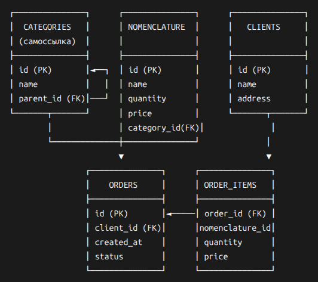
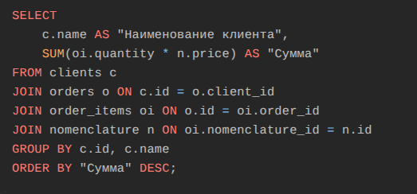
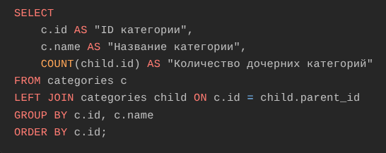
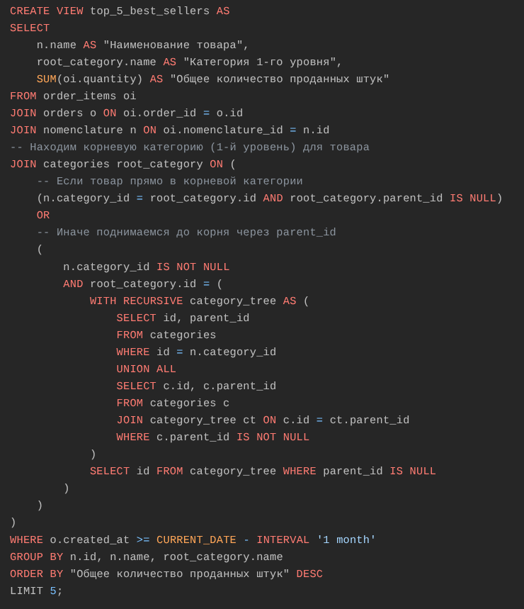

# Техническое задание: Backend

**Срок выполнения:** неделя.

**Отправка готового задания:**  
На почту `m.grishina@i-t-p.pro`.  
В теме письма укажите **Фамилию и Имя**, в теле письма — **ссылку на Git-репозиторий**.

---

## 1. Проектирование схемы БД

**Модель данных:** реляционная.

### Сущности:

#### 1.1. Номенклатура
- Наименование
- Количество
- Цена

#### 1.2. Каталог номенклатуры / Дерево категорий
Требуется хранить данные о категориях товаров с поддержкой **неограниченной вложенности**.  
Схема должна позволять добавлять категории любого уровня вложенности. Максимальный уровень вложенности на этапе проектирования неизвестен.

**Пример дерева категорий:**  
#### 1.3. Клиенты
- Наименование
- Адрес

#### 1.4. Заказы покупателей
Должна быть предусмотрена возможность формирования заказа из **разных наборов товаров**.

**Задача:** спроектировать схему БД без описания бизнес-логики.

---

## 2. SQL-запросы

### 2.1. Сумма товаров по клиентам
Получить информацию о сумме товаров, заказанных каждым клиентом.  
Вывести: **Наименование клиента, сумма**.

### 2.2. Количество дочерних категорий первого уровня
Найти количество дочерних элементов **первого уровня вложенности** для всех категорий номенклатуры.

### 2.3. Отчёт “Топ-5 самых покупаемых товаров за последний месяц”

#### 2.3.1. Запрос для представления (VIEW)
Вывести:
- Наименование товара
- Категория 1-го уровня
- Общее количество проданных штук

#### 2.3.2. Анализ и оптимизация
Проанализировать запрос из п. 2.3.1 и структуру БД.  
Предложить варианты **оптимизации запроса и схемы данных** для повышения производительности в условиях роста данных (тысячи заказов в день).

---

## 3. REST-сервис “Добавление товара в заказ”

**Метод API:** принимает:
- `order_id` (ID заказа)
- `product_id` (ID номенклатуры)
- `quantity` (количество)

**Логика:**
- Если товар уже есть в заказе — увеличить его количество.
- Если товара нет в наличии — вернуть ошибку.

**Стек:** любой Python-фреймворк.  
Приветствуется:
- Git-репозиторий с историей коммитов
- Контейнеризация (Docker)
- Документация (API, README)

---

## Итоговый результат должен включать:

1. **Даталогическая схема данных** (ER-диаграмма, SQL-скрипты создания таблиц).
2. **SQL-запросы** по разделу 2.
3. **Работающий REST-сервис** по разделу 3.

---

# Реляционная схема базы данных для системы управления товарами и заказами

# Решение:

## 1. Схема реляционной БД

### Сущности и таблицы

#### 1.1. `nomenclature` (Номенклатура)
| Поле | Тип | Описание |
|------|------|--------|
| `id` | `SERIAL PRIMARY KEY` | Уникальный ID товара |
| `name` | `VARCHAR(255)` | Наименование товара |
| `quantity` | `INTEGER` | Количество на складе |
| `price` | `DECIMAL(10,2)` | Цена за единицу |

#### 1.2. `categories` (Категории/Дерево категорий)
| Поле | Тип | Описание |
|------|------|--------|
| `id` | `SERIAL PRIMARY KEY` | Уникальный ID категории |
| `name` | `VARCHAR(255)` | Название категории |
| `parent_id` | `INTEGER REFERENCES categories(id)` | Ссылка на родительскую категорию (NULL для корневых) |

*Примечание:*  
- Структура позволяет неограниченную вложенность через `parent_id`.
- Для корневых категорий `parent_id = NULL`.

#### 1.3. `clients` (Клиенты)
| Поле | Тип | Описание |
|------|------|--------|
| `id` | `SERIAL PRIMARY KEY` | Уникальный ID клиента |
| `name` | `VARCHAR(255)` | Наименование клиента |
| `address` | `TEXT` | Адрес клиента |

#### 1.4. `orders` (Заказы)
| Поле | Тип | Описание |
|------|------|--------|
| `id` | `SERIAL PRIMARY KEY` | Уникальный ID заказа |
| `client_id` | `INTEGER REFERENCES clients(id)` | Ссылка на клиента |
| `created_at` | `TIMESTAMP DEFAULT NOW()` | Дата создания заказа |

#### 1.5. `order_items` (Позиции заказа)
| Поле | Тип | Описание |
|------|------|--------|
| `id` | `SERIAL PRIMARY KEY` | Уникальный ID позиции |
| `order_id` | `INTEGER REFERENCES orders(id)` | Ссылка на заказ |
| `nomenclature_id` | `INTEGER REFERENCES nomenclature(id)` | Ссылка на товар |
| `quantity` | `INTEGER` | Количество товара в заказе |

### Связи:

#### nomenclature.category_id → categories.id

#### orders.client_id → clients.id

#### order_items.order_id → orders.id

#### order_items.nomenclature_id → nomenclature.id

## SQL‑запросы
### 2.1. Сумма товаров, заказанных каждым клиентом

Пояснение:

Связываем clients → orders → order_items → nomenclature.

Для каждого клиента считаем сумму: количество * цена по всем позициям его заказов.

Группируем по клиенту, сортируем по сумме (убывание).

### 2.2. Дочерние категории 1‑го уровня

Пояснение:

LEFT JOIN позволяет учесть категории без дочерних (вернёт 0).

Связь: родитель (c) → дочерние (child) через parent_id.

Группировка по родительской категории, подсчёт количества дочерних.

### 2.3.1. View «Топ‑5 самых покупаемых товаров за последний месяц»

Пояснение:

Связываем order_items → orders → nomenclature → categories.

Для каждой позиции товара находим корневую категорию (1‑й уровень):

Если category_id уже корневая (parent_id IS NULL) — берём её.

Иначе используем рекурсивный запрос (WITH RECURSIVE), чтобы подняться до корня.

Фильтруем заказы за последний месяц (CURRENT_DATE - INTERVAL '1 month').

Группируем по товару и корневой категории, суммируем количество.

Сортируем по количеству (убывание), ограничиваем LIMIT 5.

### 2.3.2. Анализ и оптимизация
#### Проблемы исходного запроса:

Рекурсивный подзапрос для каждой строки nomenclature — O(n²) по числу категорий.

Полное сканирование orders из‑за отсутствия индекса по created_at.

Нет индекса по status — медленная фильтрация статусов.

Группировка по всему месяцу — высокая нагрузка при росте данных.

### Оптимизации:

#### 1. Рекурсия для каждой строки: Подзапрос WITH RECURSIVE выполняется для каждого товара в заказе, что медленно при росте данных.

Отсутствие индексов: Без индексов на orders.created_at, order_items.order_id, nomenclature.category_id запрос будет сканировать таблицы.

JOIN на больших таблицах: При тысячах заказов в день соединение order_items → orders → nomenclature → categories станет узким местом.

Предложения по оптимизации:

Добавить поле root_category_id в nomenclature

При добавлении/изменении категории товара автоматически сохранять ID корневой категории.

Убирает необходимость в рекурсии.

#### 2. Индекс на nomenclature.root_category_id.

Индексы:

sql
CREATE INDEX idx_orders_created_at ON orders (created_at);
CREATE INDEX idx_order_items_order_id ON order_items (order_id);
CREATE INDEX idx_nomenclature_root_cat ON nomenclature (root_category_id);

#### 3. Кэширование результатов

Использовать Redis для хранения топ‑5 на 5–10 минут.

Снижает нагрузку на БД.

# 3. Сервис «Добавление товара в заказ» (Python + FastAPI)

